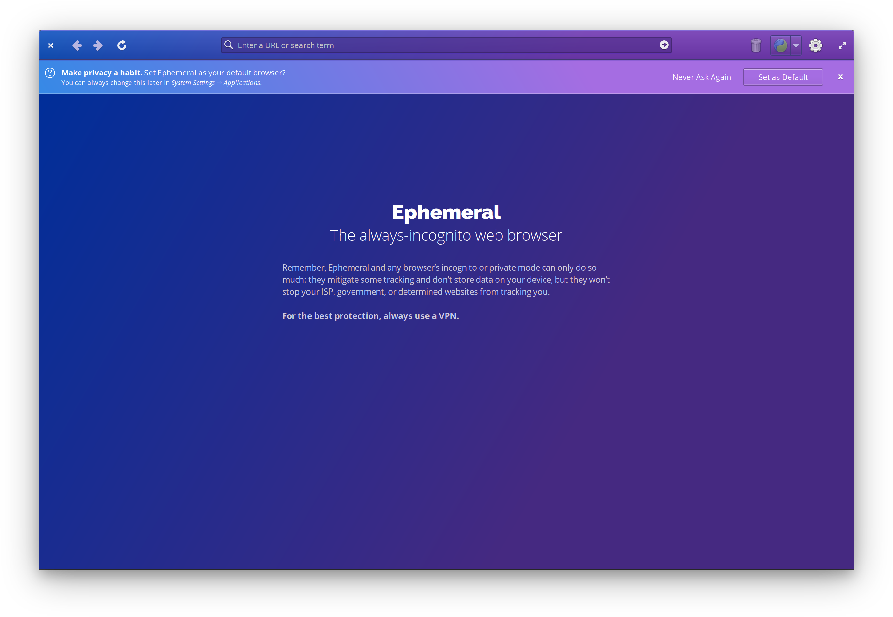
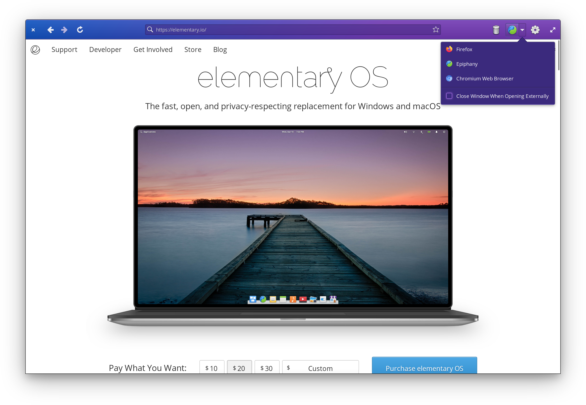
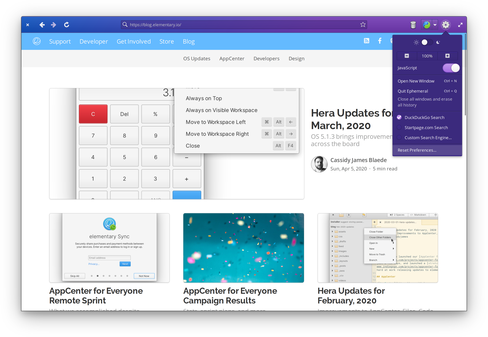
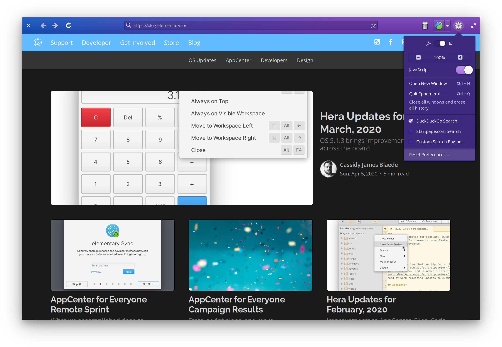

[](https://ind.ie/ethical-design)


[](https://travis-ci.com/cassidyjames/ephemeral)

<p align="center">
  
</p>
<h1 align="center">Ephemeral</h1>
<p align="center">
  <a href="https://appcenter.elementary.io/com.github.cassidyjames.ephemeral"></a>
</p>


|       |  |
|--------------------------------------------|-----------------------------------------------------|
|  |      |

## The always-incognito web browser

Browse the Internet in private without leaving a trace of history on your computer. Ephemeral is a stripped down private browser that's perfect for avoiding persistent cookies or web trackers. Close the window and all traces of your browsing are removed from your device.

## Made for [elementary OS]

Ephemeral is designed and developed on and for [elementary OS]. Purchasing through AppCenter directly supports the development and ensures instant updates straight from me. [Get it on AppCenter][AppCenter] for the best experience.

[][AppCenter]

Versions of Ephemeral may have been built and made available elsewhere by third-parties. These builds may have modifications or changes and **are not provided nor supported by me**. The only supported version is distributed via [AppCenter] on elementary OS.

## Developing and Building

Development is targeted at [elementary OS] Juno. If you want to hack on and build Ephemeral yourself, you'll need the following dependencies:

* libgranite-dev
* libgtk-3-dev
* libwebkit2gtk-4.0-dev
* libdazzle-1.0-dev
* meson
* valac

You can install them on elementary OS Juno with:

```shell
sudo apt install elementary-sdk libwebkit2gtk-4.0-dev libdazzle-1.0-dev
```

Run `meson build` to configure the build environment and run `ninja` to build:

```shell
meson build --prefix=/usr
cd build
ninja
```

To install, use `ninja install`, then execute with `com.github.cassidyjames.ephemeral`:

```shell
sudo ninja install
com.github.cassidyjames.ephemeral
```

[elementary OS]: https://elementary.io
[AppCenter]: https://appcenter.elementary.io/com.github.cassidyjames.ephemeral
